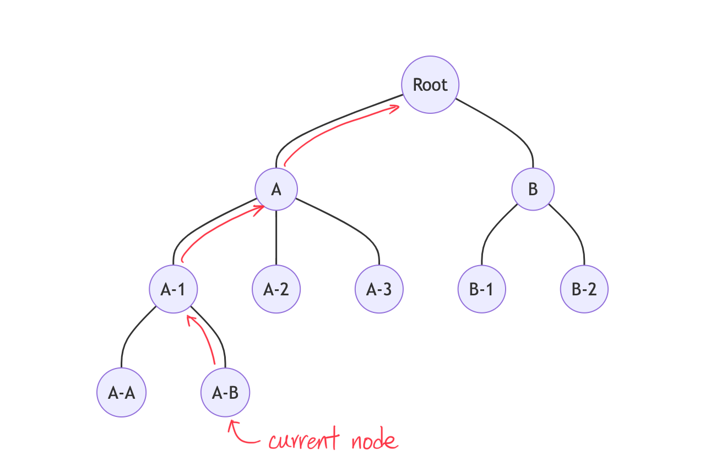
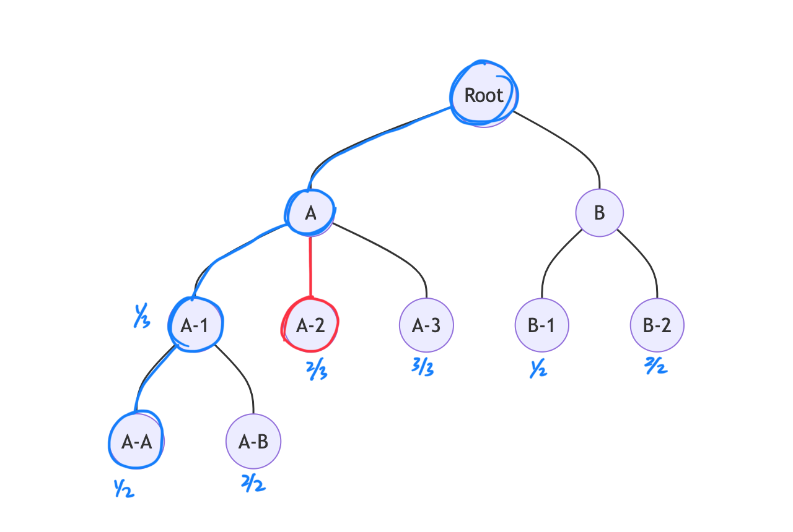
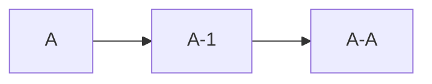
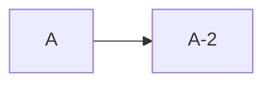

## Live Preview

link: https://littlemoonstones.github.io/ChatGPT-conversation/

> **Notice:**
>
> - This website is only intended to demonstrate the conversation structure, so it does **not use the ChatGPT API**; instead, it uses a mock API.
> - The user interface of the website has not been optimized, so we recommend using a desktop computer.

## Demo

https://user-images.githubusercontent.com/32943414/225080616-de3a7381-a2be-4200-9246-acd7d3e3ff83.mov


## Description
Based on the conversation with ChatGPT, it seems that the conversation structure resembles a **bi-directional linked list**.


Here's an example TypeScript code that defines an interface for messages and two types, `Data` and `Message`, for storing conversations (to make the typing more understandable, we simplified it).

```typescript
interface Message {
    id: string
    text: string
    parentMessageId: string
    children: string[]
}

type Data = {
    title: string
    create_time: number
    mapping: Mapping
    current_node: string
}

type Mapping = Record<string, ChatMessage>
```

Because I don't know what to name the variable, I used the `Data` type to store a conversation (although I might come up with a better name for it later). It's worth noting that `current_node` is used to record the last node in a chain of messages that the user sees, so that the next time the user comes back to the website, the same messages can be displayed.


## Conversations are Displayed

When the user enters the website and clicks on a conversation, the website sends the conversation ID (let's assume the ID is `Root`) to the server. After receiving the response from the server, the website collects the messages from the current node to `Root` and displays them to the user.



## Switch Node



The most important part is how to switch between nodes. For example, currently, when the user clicks the next button, they can see a new message displayed. For instance:

The messages that the user originally saw were:



The messages that the user will now see are:



Currently, we have an array of messages to display, like `messages = [A, A-1, A-A]`. We don't want to update or collect the messages from `A` to `A-2`, or any other nodes that might be under `A-2`. Instead, we only want to collect the messages from `A-2` to the end node, if there are any. To achieve this, we remove the old messages `A-1` and `A-A`, concatenate the messages from `A-2`, and update the `messages` array to `messages = [A, A-2]`.

In `./src/stores/chatroom.ts`

```typescript
// click child to switch next or previous
const switchNode = (index: number, increment: number) => {
    // increment: +1 or -1
    // +1: next child
    // -1: previouse child

    // collect the messages
    let tmp_message_list: ChatMessage[] = []
    let childNode = current_message_list[index]
    let parentId = childNode.parentMessageId
    if (parentId && data.value) {
        let parentNode = data.value.mapping[parentId]

        // find the index of child in parent
        let child_index = parentNode.children.indexOf(childNode.id)
        let nextChildId = parentNode.children[child_index + increment]

        // collect the message from the next child to the end node
        let currentNode = data.value.mapping[nextChildId]
        while (currentNode.children.length > 0) {
            tmp_message_list.push(currentNode)
            currentNode = data.value.mapping[currentNode.children[0]]
        }

        // Don't forget to collect the last one node
        tmp_message_list.push(currentNode)
        data.value.current_node = currentNode.id

        // replace the old messages with the other messages from next child
        current_message_list.splice(index)
        current_message_list.push(...tmp_message_list)
    }
}
```


How can we display pagination, like 1/3, 2/3, or 3/3? Each node can be seen as a component, and each component has its own `message_id`, which can be used to find its parent. This allows us to determine how many children its parent has (`mapping[message_id].parent.children.length`) and the order of the current node within its parent's children (using `indexOf`).


## Project Setup

```sh
npm install
```

### Compile and Hot-Reload for Development

```sh
npm run dev
```

### Type-Check, Compile and Minify for Production

```sh
npm run build
```

### Lint with [ESLint](https://eslint.org/)

```sh
npm run lint
```
